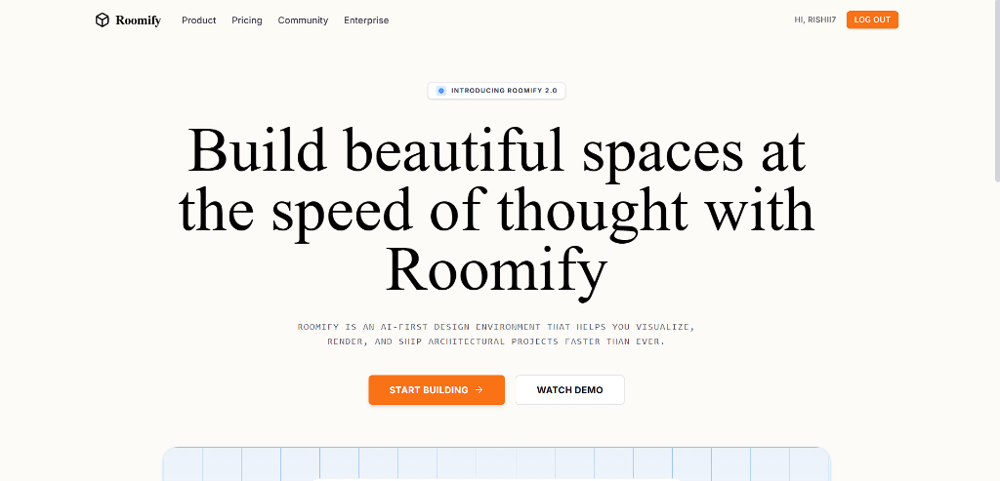
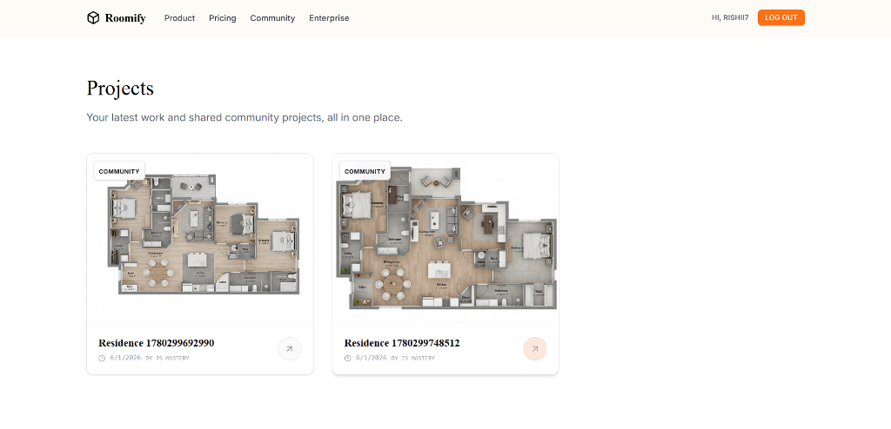

# Roomify 🏠✨

**AI-Powered Architectural 3D Visualization SaaS**

Roomify is a cutting-edge, cloud-native software-as-a-service (SaaS) platform that transforms 2D floor plans and blueprints into photorealistic 3D architectural renders instantly. 

Powered by the serverless cloud operating system **Puter.js** and Google's **Gemini AI model ecosystem**, Roomify operates entirely frontend-driven, delegating core infrastructure responsibilities—authentication, public CDN image hosting, key-value databases, and AI model execution—directly to Puter's cloud execution boundary.

---

## 📷 Screenshots

### Landing Page & Blueprint Upload Workspace


### Personal Projects & Shared Design History Dashboard


---

## 🏗️ Architectural & System Flow

The application follows a client-first, serverless architecture. Rather than relying on a custom Node/Python backend with database adapters, it integrates the Puter.js SDK directly. Data persistence is managed by custom HTTP endpoints written as **Puter Cloud Workers**, which handle secure access to Puter's globally distributed Key-Value store.

```mermaid
graph TD
    Client[Browser Client] -->|1. Drag-and-Drop Floor Plan| UploadComp[components/upload/index.tsx]
    UploadComp -->|2. Base64 String| HomeRoute[app/routes/home.tsx]
    HomeRoute -->|3. Create Project| PuterAction[lib/puter.action.ts]
    
    subgraph Puter Services (CDN/Cloud)
        PuterAction -->|4. Push Blobs| PuterHosting[lib/puter.hosting.ts]
        PuterHosting -->|5. Write File| PuterFS[(Puter File System)]
        PuterAction -->|6. Execute HTTP Call| PuterWorker[lib/puter.worker.js]
        PuterWorker -->|7. Persist Metadata| PuterKV[(Puter KV Database)]
    end
    
    HomeRoute -->|8. Navigate /visualizer/:id| VizRoute[app/routes/visualizer.$id.tsx]
    VizRoute -->|9. Fetch Project| PuterAction
    VizRoute -->|10. Execute AI Render| AIAction[lib/ai.action.ts]
    AIAction -->|11. txt2img API| Gemini[Puter AI: gemini-2.5-flash-image-preview]
    Gemini -->|12. Return 3D Image| AIAction
    VizRoute -->|13. Save Render & Render Compare| Slider[ReactCompareSlider]
```

---

## 📂 Exhaustive File-by-File Analysis

Below is an in-depth breakdown of every single file within the Roomify project structure.

---

### ⚙️ Root & Configuration Files

#### 1. [package.json](file:///d:/Projects/FullStack%20Projects/roomify/package.json)
*   **Purpose & Architecture**: Coordinates project metadata, specifies dependencies for the client-side app, manages SSR modules, and registers CLI script macros.
*   **Imports & Dependencies**:
    *   `react` & `react-dom` (v19): Power React's rendering pipeline.
    *   `react-router` (v7): Controls application routing, compilation pipelines, and page loaders.
    *   `@heyputer/puter.js` (v2): Direct serverless cloud client SDK connection.
    *   `react-compare-slider` (v4): Renders the interactive comparison UI.
    *   `lucide-react` (v0.575): Renders SVG icons.
    *   `tailwindcss` & `@tailwindcss/vite` (v4): Next-generation styling engine.
*   **Key Scripts**:
    *   `dev`: Starts the hot-reloading Vite dev server (`react-router dev`).
    *   `build`: Compiles both the client-side and server-side production bundles (`react-router build`).
    *   `start`: Serves the compiled server bundle locally (`react-router-serve ./build/server/index.js`).
    *   `typecheck`: Triggers type generation for routing parameters and executes TypeScript validation (`react-router typegen && tsc`).
*   **Interactions**: Defines project dependencies and commands. Modifying this requires rebuilding the Docker container.

---

#### 2. [tsconfig.json](file:///d:/Projects/FullStack%20Projects/roomify/tsconfig.json)
*   **Purpose & Architecture**: Declares configurations for the TypeScript compiler (`tsc`).
*   **Key Options**:
    *   `moduleResolution: "bundler"`: Configures type lookup to match the Vite bundler.
    *   `paths`: Configures absolute path mappings to avoid relative directory imports:
        *   `~/*` resolves to `./app/*` (app source).
        *   `components/*` resolves to `./components/*` (shared components).
        *   `lib/*` resolves to `./lib/*` (logic/actions).
    *   `rootDirs`: Maps dynamic routes generated by the React Router build system (`.react-router/types`).
    *   `baseUrl`: Intentionally omitted to comply with TypeScript 5.0+ standards.
*   **Interactions**: Facilitates cleaner imports (e.g., `import Button from "components/ui/button"` instead of `import Button from "../../components/ui/button"`).

---

#### 3. [types.d.ts](file:///d:/Projects/FullStack%20Projects/roomify/types.d.ts)
*   **Purpose & Architecture**: Centralized workspace for global TypeScript type definitions and interfaces.
*   **Key Declarations**:
    *   `AuthState`: Tracks authentication status (`isSignedIn: boolean`, `userName: string | null`, and `userId: string | null`).
    *   `DesignItem`: Mapped representation of a project stored in the database.
    *   `AuthContext`: Auth helper operations passed through React context (`refreshAuth`, `signIn`, and `signOut`).
    *   `AppStatus`: Enum (`IDLE`, `UPLOADING`, `PROCESSING`, `READY`) representing visual state pipelines.
    *   `HostingConfig` & `HostedAsset`: Describes Puter CDN subdomain settings.
*   **Interactions**: Imported globally across all components, actions, and page routes to enforce type safety.

---

#### 4. [Dockerfile](file:///d:/Projects/FullStack%20Projects/roomify/Dockerfile)
*   **Purpose & Architecture**: Orchestrates Docker containerization for production deployment.
*   **Internal Logic**: Multi-stage build process to optimize image size:
    *   **Stage 1 (`development-dependencies-env`)**: Installs full dependencies (`npm ci`) needed for compilation.
    *   **Stage 2 (`production-dependencies-env`)**: Installs only production dependencies (`npm ci --omit=dev`).
    *   **Stage 3 (`build-env`)**: Compiles the production build by running `npm run build` using the assets from Stage 1.
    *   **Stage 4 (Final)**: Copies production files from Stage 2 and compiled assets from Stage 3 into a clean Node environment. Exposes port 3000 and runs `npm run start`.
*   **Interactions**: Pulls source files from the host machine and creates a containerized application bundle.

---

#### 5. [react-router.config.ts](file:///d:/Projects/FullStack%20Projects/roomify/react-router.config.ts)
*   **Purpose & Architecture**: Framework settings file for React Router v7 compilation rules.
*   **Internal Logic**:
    ```typescript
    import type { Config } from "@react-router/dev/config";
    export default {
      ssr: true,
    } satisfies Config;
    ```
    Specifies `ssr: true` to generate server-side HTML for every request, enabling fast initial page loads and SEO indexability.
*   **Interactions**: Directly controls how the compiler generates files under `.react-router/` and `./build`.

---

#### 6. [vite.config.ts](file:///d:/Projects/FullStack%20Projects/roomify/vite.config.ts)
*   **Purpose & Architecture**: Configures Vite plugins and compilation settings.
*   **Key Plugins**:
    *   `tailwindcss()`: Tailwind CSS v4 compiler.
    *   `reactRouter()`: Integrates React Router's routing engine.
    *   `tsconfigPaths()`: Parses your `tsconfig.json` path mappings, ensuring absolute imports resolve correctly in bundle outputs.
*   **Interactions**: Vite reads this configuration file to boot the dev server and compile assets during production runs.

---

### 🌐 Core Application (in `app/`)

#### 7. [app/routes.ts](file:///d:/Projects/FullStack%20Projects/roomify/app/routes.ts)
*   **Purpose & Architecture**: Defines the routing tree for the application.
*   **Internal Logic**:
    ```typescript
    import { type RouteConfig, index, route } from "@react-router/dev/routes";
    export default [
        index("routes/home.tsx"),
        route('visualizer/:id', './routes/visualizer.$id.tsx')
    ] satisfies RouteConfig;
    ```
    *   Maps root path `/` to the landing dashboard (`routes/home.tsx`).
    *   Maps parameterized path `/visualizer/:id` to the editor (`routes/visualizer.$id.tsx`).
*   **Interactions**: Tells React Router which page component to compile and render based on the active browser URL.

---

#### 8. [app/app.css](file:///d:/Projects/FullStack%20Projects/roomify/app/app.css)
*   **Purpose & Architecture**: The primary stylesheet containing Tailwind CSS declarations and custom UI component classes.
*   **Key Styles**:
    *   Sets up custom color variables, fonts, borders, and layouts using Tailwind CSS v4's `@theme` syntax.
    *   Declares structural component layouts (e.g. `.dropzone`, `.compare-stage`, `.rendering-card`) using `@layer components` to isolate styles from the components themselves.
*   **Interactions**: Imported by `app/root.tsx` to apply styling rules globally across the DOM tree.

---

#### 9. [app/root.tsx](file:///d:/Projects/FullStack%20Projects/roomify/app/root.tsx)
*   **Purpose & Architecture**: The master layout and document wrapper for the entire application. It establishes the global authentication state provider.
*   **Key Logic**:
    *   `links()`: Configures global preconnects and loads the *Inter* font family from Google Fonts.
    *   `Layout({ children })`: Compiles base HTML headers, handles body viewport scales, and mounts `<ScrollRestoration />` and `<Scripts />`.
    *   `App()`: Holds `authState` state variables. 
        *   `refreshAuth()`: Asynchronously checks for active Puter.js user sessions using `getCurrentUser()`.
        *   `signIn()`: Triggers Puter's login modal.
        *   `signOut()`: Destroys user credentials and resets local session state.
        *   `Outlet`: Renders child route pages, passing `refreshAuth`, `signIn`, and `signOut` through context.
    *   `ErrorBoundary()`: Catches unhandled runtime crashes or invalid page requests (404) and renders fallback screens.
*   **Interactions**: Wraps all application routes and passes global authentication context downstream.

---

#### 10. [app/routes/home.tsx](file:///d:/Projects/FullStack%20Projects/roomify/app/routes/home.tsx)
*   **Purpose & Architecture**: Renders the landing page, file uploader component, and user projects grid.
*   **Key Functions & Logic**:
    *   `handleUploadComplete(base64Image)`: Handles file processing:
        1. Prepares a new project payload (`id`, `name`, `sourceImage`, `timestamp`).
        2. Calls `createProject` to save the project record to the Puter worker database.
        3. Navigates to `/visualizer/${newId}`, passing the image payload in route state.
    *   `useEffect`: Calls `getProjects` on mount to fetch all designs associated with the active user session and render the history grid.
    *   `isCreatingProjectRef`: A React `useRef` lock preventing multiple projects from being created concurrently during rapid uploads.
*   **Interactions**: Ingests uploads from `components/upload/index.tsx`, calls database methods from `lib/puter.action.ts`, and navigates users to `app/routes/visualizer.$id.tsx`.

---

#### 11. [app/routes/visualizer.$id.tsx](file:///d:/Projects/FullStack%20Projects/roomify/app/routes/visualizer.$id.tsx)
*   **Purpose & Architecture**: Implements the editor interface to run the AI rendering pipeline and compare changes side-by-side.
*   **Key Functions & Logic**:
    *   `loadProject`: Triggered on route change. Resolves project records from the database using `getProjectById()`.
    *   `useEffect` (generation trigger): If the project loads but lacks a `renderedImage`, it automatically triggers `runGeneration()`.
    *   `runGeneration(item)`: Sends the project's source image to `generate3DView()`. Once completed, it updates the project record in the database using `createProject()` and updates the local state.
    *   `handleExport`: Creates an offscreen `<a>` tag, sets `download` properties, references the generated image URL, and triggers an automated click to trigger browser downloads.
    *   `ReactCompareSlider`: Rendered in the "Comparison" panel to allow real-time split-screen before/after sliding of original blueprints and 3D outputs.
*   **Interactions**: Requests data via `lib/puter.action.ts`, triggers AI rendering using `lib/ai.action.ts`, and uses `react-compare-slider` for the side-by-side comparison interface.

---

### 🧱 Component Layouts (in `components/`)

#### 12. [components/navbar/index.tsx](file:///d:/Projects/FullStack%20Projects/roomify/components/navbar/index.tsx)
*   **Purpose & Architecture**: Navigation header containing branding links and auth triggers.
*   **Key Logic**:
    *   Pulls auth state (`isSignedIn`, `userName`) from the React Router outlet context (`useOutletContext<AuthContext>()`).
    *   Renders brand typography, global navigation links, and handles session logins and logouts using `handleAuthClick()`.
*   **Interactions**: Renders inside `app/routes/home.tsx` and `app/routes/visualizer.$id.tsx` to provide global navigation.

---

#### 13. [components/ui/button/index.tsx](file:///d:/Projects/FullStack%20Projects/roomify/components/ui/button/index.tsx)
*   **Purpose & Architecture**: Custom UI button wrapper.
*   **Key Logic**: Resolves configurations for sizes (`sm`, `md`, `lg`) and styles (`primary`, `secondary`, `outline`, `ghost`) into classes defined in `app/app.css`.
*   **Interactions**: Used across the homepage, navbar, and visualizer page for button elements.

---

#### 14. [components/upload/index.tsx](file:///d:/Projects/FullStack%20Projects/roomify/components/upload/index.tsx)
*   **Purpose & Architecture**: Handles file dragging, selection, type validation, and loading animations.
*   **Key Logic**:
    *   Monitors `isSignedIn` from context; upload actions are locked if the user is not authenticated.
    *   `processFile`: Reads files as base64 data URLs using `FileReader.readAsDataURL()`.
    *   `setInterval`: Simulates file parsing progress incrementing by 15% every 100ms. Calls `onComplete(base64)` upon completion.
*   **Interactions**: Mounted on `app/routes/home.tsx` to feed base64 images into the project creation callback.

---

### 💾 Library Logic & Actions (in `lib/`)

#### 15. [lib/constants/index.ts](file:///d:/Projects/FullStack%20Projects/roomify/lib/constants/index.ts)
*   **Purpose & Architecture**: Holds configuration parameters and environment variables.
*   **Key Variables**:
    *   `PUTER_WORKER_URL`: The URL of the Puter Cloud Worker API.
    *   `STORAGE_PATHS`: Defines storage paths for file system writes (`roomify/sources`, `roomify/renders`).
    *   `ROOMIFY_RENDER_PROMPT`: The system prompt for the Gemini AI model. Instructs the model to clean all text, extrude geometry walls, map layout icons (beds, sofas, tables) to realistic items, and output a bright top-down 3D render.
*   **Interactions**: Imported across `lib/ai.action.ts`, `lib/puter.action.ts`, and `lib/puter.hosting.ts` to access constant values.

---

#### 16. [lib/utils/index.ts](file:///d:/Projects/FullStack%20Projects/roomify/lib/utils/index.ts)
*   **Purpose & Architecture**: Foundational file system, blob formatting, and network helper utilities.
*   **Key Functions**:
    *   `createHostingSlug`: Generates custom names (`roomify-[base36]-[random]`).
    *   `getHostedUrl`: Formulates full HTTPS URL links for files based on the subdomain.
    *   `getImageExtension`: Reads file headers, Base64 metadata, or URL extensions to map MIME types to correct file formats.
    *   `dataUrlToBlob`: Restores base64 strings into binary Blob formats.
    *   `imageUrlToPngBlob`: Draws remote images on an offscreen `<canvas>` context and processes them into a clean PNG Blob to bypass CORS headers.
*   **Interactions**: Imported by `lib/puter.hosting.ts` and `lib/puter.action.ts` to convert and format images before saving.

---

#### 17. [lib/ai.action.ts](file:///d:/Projects/FullStack%20Projects/roomify/lib/ai.action.ts)
*   **Purpose & Architecture**: Connects the frontend to Puter's AI service APIs.
*   **Key Functions**:
    *   `generate3DView`: Accepts project image sources, splits off headers to isolate base64 data, and calls `puter.ai.txt2img(...)`.
    *   **Configuration**: Selects the Gemini provider (`gemini`) running model **`gemini-2.5-flash-image-preview`** at a `1024x1024` resolution with the `ROOMIFY_RENDER_PROMPT`.
*   **Interactions**: Called by `app/routes/visualizer.$id.tsx` to render raw floor plans into 3D visualizations.

---

#### 18. [lib/puter.action.ts](file:///d:/Projects/FullStack%20Projects/roomify/lib/puter.action.ts)
*   **Purpose & Architecture**: Handles database and remote API network tasks.
*   **Key Functions**:
    *   `createProject`: Resolves subdomains using KV hosting settings, uploads blueprint images to the CDN, and executes Puter Cloud Worker HTTP calls to write the project records.
    *   `getProjects`: Pulls project histories by requesting lists from Puter Cloud Worker endpoints.
    *   `getProjectById`: Fetches project records from the worker database.
*   **Interactions**: Integrates components (homepage lists, editor states) with Puter Cloud Worker endpoints.

---

#### 19. [lib/puter.hosting.ts](file:///d:/Projects/FullStack%20Projects/roomify/lib/puter.hosting.ts)
*   **Purpose & Architecture**: Directs static file system deployments to Puter's CDN.
*   **Key Functions**:
    *   `getOrCreateHostingConfig`: Searches Puter KV for a subdomain. If missing, registers a new one via `puter.hosting.create()` and saves it.
    *   `uploadImageToHosting`: Converts URLs into Blob objects, makes missing folders in Puter storage (`puter.fs.mkdir`), writes the file to the path (`puter.fs.write`), and returns the public CDN URL.
*   **Interactions**: Called by `lib/puter.action.ts` to convert base64 image strings to public URLs before database records are saved.

---

#### 20. [lib/puter.worker.js](file:///d:/Projects/FullStack%20Projects/roomify/lib/puter.worker.js)
*   **Purpose & Architecture**: Router script running on Puter's serverless edge. It acts as the backend API to handle authentication and KV database operations.
*   **Key Endpoints**:
    *   `/api/projects/save`: Verifies user auth, creates metadata payloads, and stores them under KV key `roomify_project_${id}`.
    *   `/api/projects/list`: Performs prefix searches on user KV spaces for `roomify_project_` to return saved items.
    *   `/api/projects/get`: Resolves project details from KV storage.
*   **Interactions**: Receives HTTP calls from `lib/puter.action.ts` client-side API integrations.

---

## 🛠️ Installation & Configuration

### 1. Prerequisites
*   **Node.js**: `v20.0.0` or higher.
*   **pnpm**: `v10.0.0` or higher.
*   **Browser**: A modern browser that supports standard HTML Drag-and-Drop and FileReader APIs.

### 2. Dev Environment Installation
```bash
# Clone the repository
git clone https://github.com/RISHII7/roomify.git
cd roomify

# Install dependencies using pnpm
pnpm install
```

### 3. Setup Environment Variables
Create a `.env` file at the root of the project directory to define your Puter Cloud Worker URL:
```env
VITE_PUTER_WORKER_URL=https://your-puter-worker-subdomain.puter.work
```

### 4. Running the Dev Server
```bash
pnpm run dev
```
Open **[http://localhost:5173](http://localhost:5173)**. If environment variables do not load on first run, perform a hard refresh (`Ctrl + F5` or `Cmd + Shift + R`).

### 5. Production Compilation & Build
```bash
pnpm run build
```

### 6. Container Deployment (Docker)
Build and run the multi-stage Docker container locally:
```bash
docker build -t roomify .
docker run -p 3000:3000 roomify
```
Open **[http://localhost:3000](http://localhost:3000)** in your browser.
